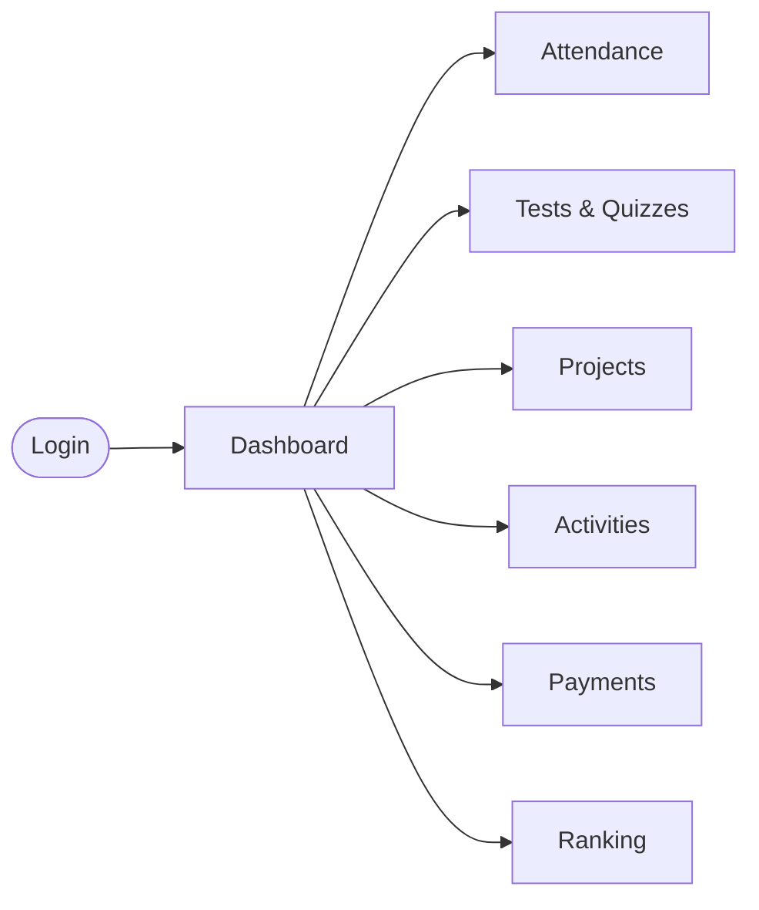
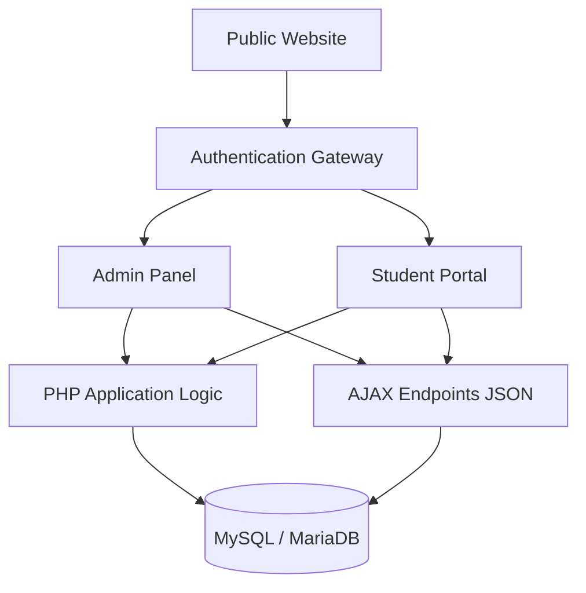
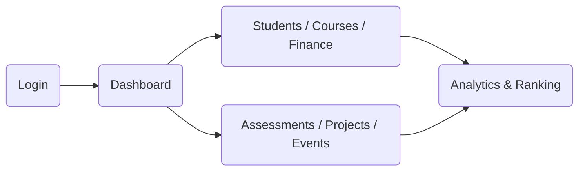
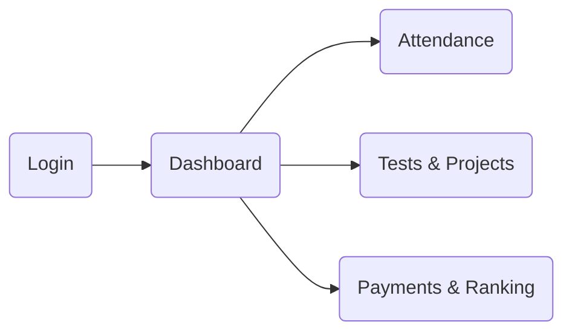
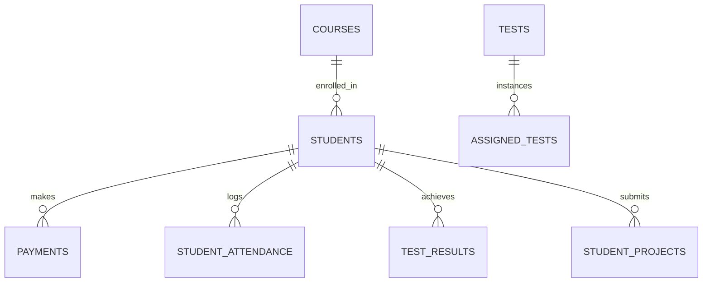

<div align="center">


<p>
  <strong>Manage students, courses, attendance, fees, assessments, projects, events, and performance from one unified platform.</strong>
</p>

<p align="center">
  
  
  
  
  
</p>

<p align="center">
  
  
  
  
</p>

<a href="https://git.io/typing-svg">
  
</a>

</div>

---

## 📊 Product Snapshot

| 🎓 Students | 📚 Courses | 📅 Attendance |
| :--- | :--- | :--- |
| **Manage learner profiles**, track active/hold statuses, assign batches, and view comprehensive student analytics. | **Manage curriculum**, categorize topics, assign course fees, and organize study group materials. | **Check-in / Check-out**, automatically handle Sundays/holidays, and view detailed attendance reports. |

| 💰 Finance | 📝 Assessments | 🏆 Performance |
| :--- | :--- | :--- |
| **Fees & receipts**, track pending payments, identify overdue students, and log institute expenses. | **Tests & quizzes**, assign MCQs, auto-save answers, grade submissions, and host typing competitions. | **Ranking & points**, dynamically calculate leaderboard scores based on tests, projects, and manual points. |

---

## 🧭 Quick Navigation

<details>
<summary><b>Click to expand Table of Contents</b></summary>

- [💡 Why Next Academy?](#-why-next-academy)
- [🧩 Feature Ecosystem](#-feature-ecosystem)
- [🧑‍💼 Admin Panel](#-admin-panel)
- [🎓 Student Portal](#-student-portal)
- [📅 Attendance](#-attendance)
- [💰 Finance](#-finance)
- [📝 Tests & Assessments](#-tests--assessments)
- [🚀 Project Management](#-project-management)
- [🏆 Ranking & Gamification](#-ranking--gamification)
- [🎉 Events & Activities](#-events--activities)
- [📞 Inquiry / Lead Management](#-inquiry--lead-management)
- [🌐 Public Website](#-public-website)
- [🌟 Platform Experience](#-platform-experience)
- [🏗️ Architecture](#-architecture)
- [🔄 User Workflows](#-user-workflows)
- [🗄️ Database Section](#️-database-section)
- [🛠️ Tech Stack](#️-tech-stack)
- [🔐 Security](#-security)
- [📦 Installation](#-installation)
- [🌐 Hosting / Deployment](#-hosting--deployment)
- [📁 Project Structure](#-project-structure)
- [⚡ Performance](#-performance)
- [🔮 Future Roadmap](#-future-roadmap)
- [👨‍💻 Developer & Credits](#-developer--credits)

</details>

---

## 💡 Why Next Academy?

**The Problem:**
Managing an educational institute often involves a chaotic mix of disconnected tools. Academy owners struggle with student records spread across spreadsheets, manual attendance tracking, disorganized fee collection, disconnected test grading, and invisible student performance metrics.

**The Solution:**
Next Academy SaaS brings all academy operations into **one unified platform**. It seamlessly connects the public-facing lead generation website to an administrative operational CRM, which directly powers an interactive student LMS portal. Every module talks to the same database, ensuring that when a student pays a fee, takes a test, or attends a class, the entire system updates instantly.

---

## 🧩 Feature Ecosystem

<table width="100%">
<tr>
<td width="33%" valign="top">

### 🎓 Students
- Student profiles
- Batch management (Morning/Evening)
- Status tracking (Active, Hold, Past)
- Student analytics

</td>
<td width="33%" valign="top">

### 📚 Courses
- Course categories
- Detailed topics
- Course fees & durations
- Curriculum management

</td>
<td width="33%" valign="top">

### 📅 Attendance
- Daily check-in/check-out
- Present/Absent statuses
- Automated holiday handling
- Detailed admin reports

</td>
</tr>
<tr>
<td width="33%" valign="top">

### 💰 Finance
- Total fee tracking
- Pending amount calculation
- Overdue student filters
- Receipt generation

</td>
<td width="33%" valign="top">

### 📝 Assessments
- MCQ Test creation
- Test assignments
- Quiz interface with auto-save
- Typing competitions

</td>
<td width="33%" valign="top">

### 🚀 Projects & Ranks
- Project assignments
- Admin verification
- Dynamic ranking system
- Performance leaderboards

</td>
</tr>
</table>

---

## 🧑‍💼 Admin Panel
The Admin Panel serves as the operational command center for the academy, protected by robust Role-Based Access Control (Super Admin, Admin, Administrator, HR).

<details>
<summary><b>View Admin Modules</b></summary>

- **Dashboard:** At-a-glance analytics and Chart.js visualizations.
- **Student Management:** Manage profiles, group details, student holds, past students, and course expiries.
- **Course Management:** Configure available courses, categories, and module topics.
- **Attendance:** View batch-wide attendance percentages and detailed reports.
- **Finance:** Record payments, log expenses, generate receipts, and view full overdue student lists.
- **Tests:** Create tests, assign them to students/batches, and view typing competition results.
- **Projects & Tasks:** Assign tasks, run manual task crons, and verify student project submissions.
- **Events:** Schedule upcoming events and track participation.
- **Inquiries:** Manage leads captured from the public website.
- **Ranking & Analytics:** View the global leaderboard and deep-dive into student performance analytics.
</details>

---

## 🎓 Student Portal

The Student Portal gives every enrolled learner an authenticated, interactive LMS workspace to manage their academic journey.



**Student Capabilities:**
- **Dashboard:** View attendance percentage, pending fees, and current rank.
- **Attendance:** Self-service check-in and check-out tracking.
- **Tests & Quizzes:** Take assigned quizzes with real-time answer saving and view past results.
- **Typing Competition:** Measure WPM speed against peers.
- **Projects:** Upload project links/files for admin review.
- **Payments & Receipts:** Transparent tracking of fee progress and receipt downloads.
- **Activities:** Track participation in past and upcoming events.
- **Tasks & Profile:** Manage assigned tasks and update personal information.

---

## 📅 Attendance

The attendance engine intelligently calculates student participation without penalizing them for off-days.

| Status | Meaning & Logic |
| :---: | :--- |
| 🟢 **Present** | Student checked in for the day. Counts positively towards percentage. |
| 🔴 **Absent** | Active student missed a working day. Counts negatively. |
| ⚪ **Holiday** | Official holiday or Sunday. **Automatically handled** to not impact the student's attendance percentage. |

**Key Features:** Check-in/check-out timestamps, detailed admin attendance reports, batch filtering, and automated Sunday exclusions.

---

## 💰 Finance

The finance module tracks the financial health of the academy and individual students.

- **Total & Pending Fees:** Dynamically calculates remaining balances based on `total_fees` minus `amount_paid`.
- **Payments:** Admins manually record successful payments.
- **Receipts:** The system generates downloadable payment receipts.
- **Overdue Tracking:** Automatically identifies students who have pending balances and missed their current month's payment.
- **Expenses:** Log and track internal academy expenses.

---

## 📝 Tests & Assessments

A complete end-to-end evaluation engine.

```text
Create MCQ Test ➡️ Add Questions ➡️ Assign to Batch/Student ➡️ Student Takes Quiz (Auto-Saves) ➡️ Submit ➡️ Auto-Graded Result ➡️ Points Awarded
```

**Key Features:** Real-time auto-saving during quizzes, dynamic result calculation, and dedicated typing competitions to measure and track WPM speed.

---

## 🚀 Project Management

Bridge the gap between theoretical learning and practical application.

```text
Project Assigned ➡️ Student Submits File/Link ➡️ Admin Reviews ➡️ Verification Status Updated ➡️ Points Awarded
```

**Key Features:** Dedicated submission portals, admin verification queues, and direct integration into the student's ranking profile.

---

## 🏆 Ranking & Gamification

Students are ranked on a dynamic monthly leaderboard to encourage healthy competition. Points are strictly verified from actual academic performance:

<div align="center">
  <h3><code>Test Points + Verified Project Points + Admin Manual Points = Total Ranking Score</code></h3>
</div>

**Key Features:** Real-time leaderboard generation, aggregate performance tracking, and transparent scoring visible on the student dashboard.

---

## 🎉 Events & Activities

Manage academy culture and extracurricular engagement.

- **Event Management:** Create events with dates, times, categories, and visual icons.
- **Event Statuses:** Automatically categorize as Upcoming, Completed, or Cancelled.
- **Participation History:** Admins mark participation, creating a permanent activity history for students to view in their portal.

---

## 📞 Inquiry / Lead Management

Seamlessly connect public interest with admin operations.

```text
Website Visitor ➡️ Submits Contact Form ➡️ Inquiry Record Created ➡️ Admin Views Details ➡️ Offline Follow-up
```

**Key Features:** Capture contact info, track inquiry statuses, and view detailed lead records directly in the Admin Panel.

---

## 🌐 Public Website

Modern, responsive landing pages designed to convert visitors into students.

| Page | Purpose |
| :--- | :--- |
| 🏠 **Home** | Features a smart Activity Calendar, course highlights, and academy stats. |
| ℹ️ **About** | Mission, vision, and academy information. |
| 📚 **Courses** | Comprehensive catalog of available programs. |
| 🎯 **Specialized** | Detailed landing pages for `Digital Marketing Pro`, etc. |
| 🖼️ **Gallery** | Visual showcase of academy life and infrastructure. |
| 📞 **Contact** | Inquiry generation and location details. |

---

## 🌟 Platform Experience

*(Conceptual visuals representing the platform's core modules)*

<table width="100%">
  <tr>
    <td align="center" width="50%">
      
      <br><b>Student Learning Experience</b>
      <p><i>Interactive portal for tests, projects, and attendance.</i></p>
    </td>
    <td align="center" width="50%">
      
      <br><b>Admin Operational Analytics</b>
      <p><i>Comprehensive dashboards for tracking academy health.</i></p>
    </td>
  </tr>
  <tr>
    <td align="center" width="50%">
      
      <br><b>Transparent Finance Tracking</b>
      <p><i>Clear visibility into fee payments and overdue balances.</i></p>
    </td>
    <td align="center" width="50%">
      
      <br><b>Gamified Performance Ranking</b>
      <p><i>Dynamic leaderboards driving student engagement.</i></p>
    </td>
  </tr>
</table>

---

## 🏗️ Architecture



---

## 🔄 User Workflows

### Admin Workflow


### Student Workflow


---

## 🗄️ Database Section

The application uses a robust relational database schema.

### Table Groupings:
- **Authentication:** `admins`
- **Students:** `students`, `student_groups`, `student_hold_history`
- **Courses:** `courses`, `course_topics`, `categories`
- **Attendance:** `student_attendance`
- **Finance:** `payments`, `expenses`
- **Assessments:** `tests`, `questions`, `assigned_tests`, `test_results`, `student_answers`
- **Projects & Tasks:** `student_projects`
- **Events:** `events`, `event_participants`
- **Leads:** `inquiries`

### Core Relationships


---

## 🛠️ Tech Stack

| Layer | Technology | Purpose |
| :--- | :--- | :--- |
| **Backend** | PHP 7.4+ | Core server-side application logic |
| **Database** | MySQL/MariaDB | Persistent relational data storage |
| **Frontend** | HTML5 / CSS3 / JS | Interface structure and interaction |
| **UI Framework** | Bootstrap 5 | Responsive layout and UI components |
| **Charts** | Chart.js | Visual analytics dashboards |
| **Icons** | Font Awesome | Interface iconography |

---

## 🔐 Security

**Currently Implemented Mechanisms:**
- **Session Management:** Native PHP `$_SESSION` handling with isolation between Admin and Student portals.
- **Password Security:** One-way hashing using PHP's native `password_hash()` and `password_verify()`.
- **SQL Injection Prevention:** Extensive use of `mysqli` prepared statements (`$stmt->prepare()`).
- **Role-Based Access:** Strict authorization checks (`requireLogin()`, `isSuperAdmin()`) across admin files.
- **Student Data Isolation:** Backend AJAX endpoints rely on `$_SESSION['student_id']` rather than trusting unverified POST data.

### ⚠️ Recommended Production Hardening
*(Recommendations for deploying at scale, not currently in source code)*
- [ ] Enforce HTTPS/TLS across all endpoints.
- [ ] Implement CSRF tokens for all form submissions.
- [ ] Configure secure session cookies (`Secure`, `HttpOnly`).
- [ ] Add basic rate limiting to `auth/login.php` to prevent brute force attacks.
- [ ] Automated database backups.

---

## 📦 Installation

**Complete Developer Setup Guide:**

1. **Requirements:** XAMPP, WAMP, MAMP, or a similar Apache/PHP/MySQL environment.
2. **Clone the Repository:**
   ```bash
   git clone https://github.com/ArshlanKhan786/NextMainSaas.git
   ```
3. **Move to Server Root:** Place the cloned folder inside your web server's root (`htdocs` or `www`).
4. **Database Creation:**
   - Open phpMyAdmin.
   - Create a new database (e.g., `next_academy`).
5. **SQL Import:**
   - Import the provided schema/data SQL file into your new database.
6. **Credential Configuration:**
   - Edit `admin/config/database.php` and `admin/config/db_credentials.php` with your local database credentials (usually `root` and an empty password).
7. **Run Locally:**
   - Public Website: `http://localhost/NextMainSaas/index.php`
   - Admin Login: `http://localhost/NextMainSaas/auth/login.php`

---

## 🌐 Hosting / Deployment

**Deployment to Shared Hosting (cPanel / Hostinger):**

```text
Upload Repository ZIP ➡️ Extract in public_html ➡️ Create MySQL DB & User in cPanel ➡️ Import SQL File ➡️ Configure DB Credentials in admin/config/database.php ➡️ Set Folder Permissions (755) ➡️ Test Access
```

---

## 📁 Project Structure

```text
NextMainSaas/
├── admin/               # Administrative operational logic & views
│   ├── ajax/            # Admin JSON endpoints (project verification, topics)
│   ├── config/          # Database connection & global auth configurations
│   ├── includes/        # Shared admin UI (navbar, sidebar, ranking helpers)
│   └── assets/          # Admin-specific CSS/JS
├── student/             # Student portal LMS interface
│   ├── ajax/            # Student JSON endpoints (quiz saving, project submissions)
│   ├── includes/        # Shared student UI elements
│   └── assets/          # Student-specific styles and scripts
├── auth/                # Centralized login gateway
├── assets/              # Public website CSS, JS, and Images
├── includes/            # Public shared UI (Navbar, Footer, Splash Screen)
├── migrations/          # Database schema migrations
├── sql/                 # SQL utilities and schema definitions
├── index.php            # Dynamic public homepage
├── about.php            # Public academy info
├── contact.php          # Public inquiry form
└── README.md            # This documentation
```

---

## ⚡ Performance

### Existing Implementation
- **Lightweight Architecture:** Procedural PHP logic ensures minimal server overhead compared to heavy MVC frameworks.
- **AJAX Interactions:** Forms (like quizzes and course topic management) submit via asynchronous JS, reducing full-page reloads.

### 🚀 Recommended Production Optimizations
*(Planned improvements for scaling)*
- **OPcache:** Enable PHP OPcache on the production server.
- **Database Indexing:** Add indexes to high-read foreign keys (e.g., `student_attendance.student_id`).
- **Asset Minification:** Minify public CSS/JS files.
- **Pagination:** Implement server-side pagination for long lists (e.g., Past Students, Test Results).

---

## 🔮 Future Roadmap

*The following features are planned ideas and potential future expansions. They are **not currently implemented** in the repository.*

- [ ] **Multi-Tenant Architecture:** Support for multiple distinct academy branches.
- [ ] **Payment Gateway Integration:** Stripe/Razorpay for online fee collection.
- [ ] **Automated Notifications:** WhatsApp API and SMS alerts for attendance/overdue fees.
- [ ] **Subscription Billing:** SaaS billing logic for academy owners.
- [ ] **REST API:** Headless backend support for a future mobile application.
- [ ] **Custom Domains:** Allow academies to use their own URLs.

---

## 🤝 Contributing

Contributions to improve Next Academy SaaS are welcome! Please follow these development guidelines:
- Reuse existing authentication helpers (`admin/config/auth.php`).
- Always use prepared statements for database queries.
- Maintain the procedural architecture and Bootstrap 5 UI patterns.
- Protect admin-only actions with strict role checks.

---

<div align="center">

## 👨‍💻 Built & Maintained By

### **ArshlanKhan786**
Developer • Creator • Maintainer

[](https://github.com/ArshlanKhan786)

<br>

**Next Academy SaaS**

Built with ❤️, code, and continuous learning.

---

⭐ If you find this project useful, consider giving the repository a star.

</div>
